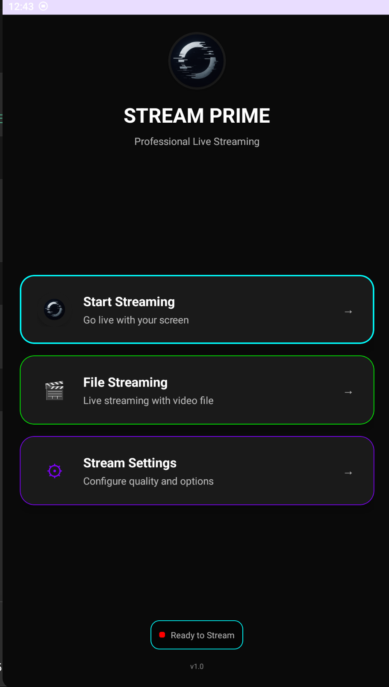
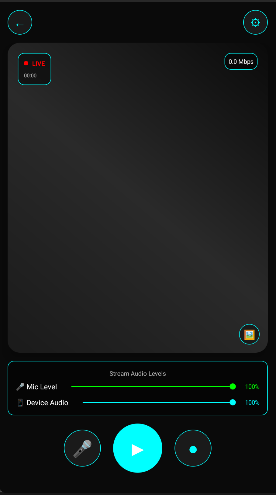
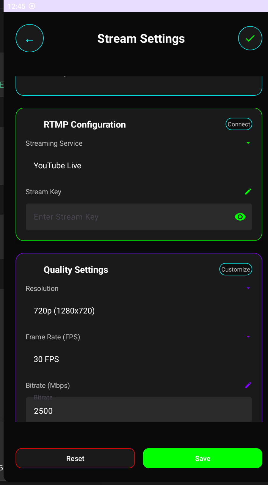
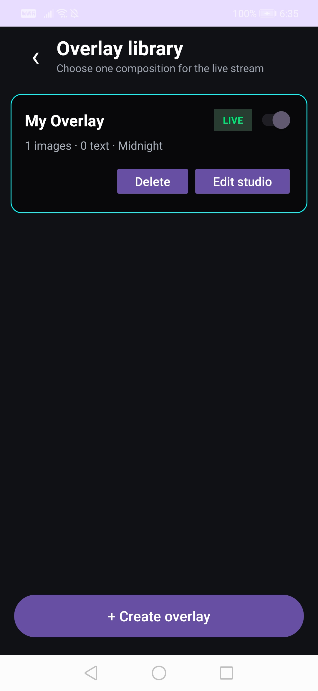
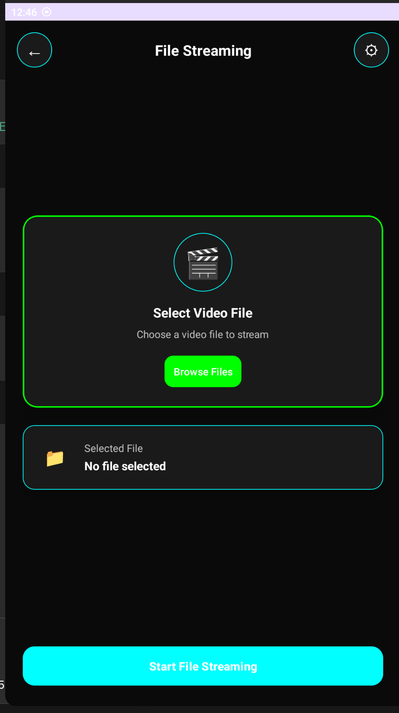

# Stream Prime

> A free and open-source Android live streaming app with RTMP broadcasting, custom overlays, screen capture, file streaming, and creator-friendly mobile controls.

[](#)
[](#tech-stack)
[](https://github.com/pedroSG94/RootEncoder)
[](LICENSE)
[](#contributing)

Stream Prime is a developer-friendly mobile live-streaming app for Android creators, gamers, and builders who need a flexible RTMP streaming app with a beautiful UI and custom overlay support. It is built on top of RootEncoder-powered streaming and encoding modules, making it a strong starting point for an Android RTMP broadcaster, mobile broadcasting app, or custom overlay streaming app.

## ✨ Features

- 📱 Android live streaming app built for mobile creators and developers
- 🔴 RTMP streaming support for YouTube Live, Twitch, Facebook Live, Instagram Live, TikTok Live, and custom RTMP servers
- 🖥️ Screen broadcasting with foreground service support
- 🎥 Camera and screen based streaming flows
- 🗂️ File streaming support for broadcasting pre-recorded video
- 🧩 Custom overlay support with image and text overlay workflows
- 🎛️ Overlay layer management for creator-controlled stream layouts
- ⚙️ Configurable resolution, FPS, bitrate, audio volume, and quality settings
- 🎙️ Microphone and internal audio support where Android permissions allow it
- 🔁 Reconnect handling for unstable network conditions
- 🎨 Modern mobile UI with streaming mode selection, settings, and live status states
- 🧪 Multi-module Android project structure for developers who want to extend streaming internals

## 📸 Screenshots

| Home | Audio Levels | Stream Settings |
| --- | --- | --- |
|  |  |  |

| Overlay Layers | File Streaming |
| --- | --- |
|  |  |

## 🎬 Demo

Demo video placeholder:

- YouTube demo: `Will Be Added Soon`
- GIF preview: `media/demo/stream-prime-demo.gif`

## 🧰 Tech Stack

- Android SDK, min SDK 21 for the app
- Kotlin and Java
- Gradle Kotlin DSL
- AndroidX AppCompat, ConstraintLayout, MultiDex, CameraX, Media3
- Material Components for Android
- Gson for overlay/config persistence
- RootEncoder modules for streaming, encoding, RTMP, RTSP, SRT, UDP, and media sources

## 📦 Project Structure

```text
.
├── app/              # Stream Prime Android app
├── common/           # Shared RootEncoder networking/media utilities
├── encoder/          # Audio/video encoding and filters
├── library/          # High-level streaming APIs
├── rtmp/             # RTMP client implementation
├── rtsp/             # RTSP client implementation
├── srt/              # SRT implementation
├── udp/              # UDP streaming implementation
├── extra-sources/    # CameraX, UVC, Media3, bitmap, and file sources
├── gradle/           # Gradle wrapper and version catalog
└── media/            # Screenshot and demo placeholders
```

## ✅ Requirements

- Android Studio Ladybug or newer recommended
- JDK 17
- Android SDK platform 36
- Android NDK 26.1.10909125
- A real Android device for camera, microphone, screen capture, and RTMP testing
- An RTMP destination such as YouTube Live, Twitch, Facebook Live, or your own media server

## 🚀 Installation

Clone the repository:

```bash
git clone https://github.com/Saswata-Codes/stream-prime.git
cd stream-prime
```

Open the project in Android Studio and let Gradle sync.

If you build from the terminal, make sure your Android SDK is configured by Android Studio or through `ANDROID_HOME`/`ANDROID_SDK_ROOT`.

## 🏗️ Build

Run tests:

```bash
./gradlew test
```

Build a debug APK:

```bash
./gradlew assembleDebug
```

Install on a connected device:

```bash
./gradlew installDebug
```

Build a release APK:

```bash
./gradlew assembleRelease
```

Release signing is intentionally not configured in the repository. Keep signing keys outside Git and configure them locally or in secure CI secrets.

## 📖 Usage

1. Launch Stream Prime on an Android device.
2. Grant camera, microphone, notification, and screen capture permissions when prompted.
3. Open Stream Settings.
4. Select a streaming service or choose Custom RTMP.
5. Enter the RTMP URL and stream key from your streaming platform.
6. Choose resolution, FPS, bitrate, and audio options.
7. Add custom overlays from the overlay editor if needed.
8. Start streaming and monitor connection status and bitrate.

## ⚙️ Configuration

Common options available in the app:

| Option | Purpose |
| --- | --- |
| Streaming service | Select YouTube Live, Twitch, Facebook Live, Instagram Live, TikTok Live, or Custom RTMP |
| Stream URL | Base RTMP endpoint for custom servers |
| Stream key | Private key/token provided by the streaming platform |
| Resolution | Controls output size such as 720p or 1080p |
| FPS | Controls frame rate for smoother or lighter streams |
| Bitrate | Controls video quality and network usage |
| Audio source | Configure microphone/internal audio behavior where supported |
| Overlay layers | Add and manage visual layers on top of the stream |

Never commit real stream keys, signing keys, tokens, or private RTMP URLs.

## 🧩 Custom Overlays

Stream Prime includes custom overlay support for creators who want branding, alerts, labels, images, and stream decorations directly from mobile.

Overlay-related components live in:

```text
app/src/main/java/com/stream/prime/overlay/
```

Key pieces:

- `OverlayEditorActivity` manages overlay creation/editing UI.
- `LayerManagerActivity` helps organize overlay layers.
- `OverlayManager` persists overlay configuration.
- `LayerCanvasRenderer` and renderer classes draw overlays into the stream pipeline.

Typical overlay workflow:

1. Open the overlay editor.
2. Add an image or text layer.
3. Position and scale it for your stream layout.
4. Save the configuration.
5. Start the stream and the overlay renderer applies the configured layers.

## 🔐 Security And Privacy

- Stream keys are entered by users at runtime and should be treated as secrets.
- Do not log full RTMP URLs in production builds because they can include stream keys.
- Do not commit `local.properties`, signing files, `.env` files, API keys, private URLs, or generated APK/AAB artifacts.
- Report vulnerabilities using the process in [SECURITY.md](SECURITY.md).

## 🙌 Credits And Acknowledgements

Special thanks to the [RootEncoder](https://github.com/pedroSG94/RootEncoder) open-source project and its contributors for providing powerful streaming and encoding functionality that helped make this project possible.

This project also thanks the maintainers of:

- Android Open Source Project
- Kotlin
- AndroidX
- Material Components for Android
- CameraX
- Media3
- Ktor networking
- Gson
- JUnit
- Mockito Kotlin
- UVCAndroid

See [NOTICE](NOTICE) for attribution notes.

## 🗺️ Roadmap

- [ ] Add official screenshots and a short demo video
- [ ] Add automated UI smoke tests
- [ ] Add sample RTMP server setup docs
- [ ] Add overlay templates for creators
- [ ] Add import/export for overlay packs
- [ ] Add more privacy controls for debug logging
- [ ] Add GitHub Releases with signed APK artifacts

## 🤝 Contributing

Contributions are welcome. Good first contributions include bug fixes, UI polish, documentation, test coverage, device compatibility reports, and overlay templates.

Read [CONTRIBUTING.md](CONTRIBUTING.md) before opening a pull request.

## 📄 License

This repository is released under the Apache License 2.0. See [LICENSE](LICENSE).

The project includes and adapts source code from RootEncoder, which is also licensed under Apache License 2.0. Existing upstream copyright headers must be preserved.

## 📬 Contact

Created and maintained by Saswata.

- GitHub profile: [Saswata-Codes](https://github.com/Saswata-Codes)
- Profile repository reference: [Saswata-Codes/Saswata-Codes](https://github.com/Saswata-Codes/Saswata-Codes)

## 🔎 Suggested GitHub Topics

`android`, `kotlin`, `live-streaming`, `mobile-live-streaming`, `rtmp`, `rtmp-streaming`, `android-rtmp-broadcaster`, `rootencoder`, `streaming-overlay`, `custom-overlay`, `screen-recording`, `mobile-broadcasting`, `open-source-live-streaming`
